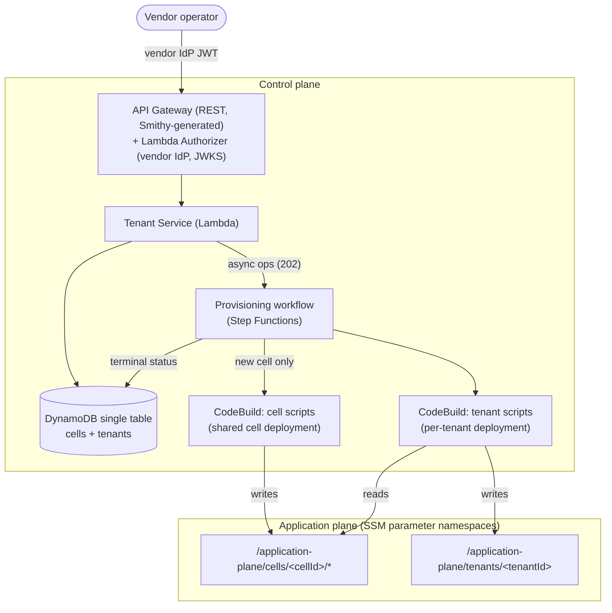

# The Simple Cell-Based Control Plane

A minimal multi-tenant SaaS control plane for **cell-based deployments**. A
cell is a deployment unit: one **shared application deployment** plus up to
`maxTenants` tenants, each with its **own per-tenant deployment** inside the
cell. Set `maxTenants: 1` and the model degenerates to a silo — one tenant
per cell. One service, one API (11 operations), one DynamoDB table, one Step
Functions workflow, two shared AWS CodeBuild projects.

- Design: [`architecture.md`](./architecture.md)
- Decisions and their reasoning trail: [`control-plane.adr.md`](./control-plane.adr.md)
- Working specification the sample was built from: [`design/control-plane.spec.md`](./design/control-plane.spec.md)

## Architecture



One service, one API, one DynamoDB table, one state machine — and two shared
CodeBuild projects whose separate service roles enforce the
cell-script/tenant-script permission boundary.

## How it works

```
CreateTenant (202) ─► placement: claim a slot in an ACTIVE cell with capacity,
                      or create a new cell record atomically (implicit creation)
                   ─► Step Functions ─► CodeBuild runs your cell create script
                                        (new cell only), then your tenant
                                        create script
GetTenant       ◄─ poll until ACTIVE / CREATE_FAILED
```

Provisioning is defined once, at deployment time, by a **CellDefinition**
(CDK context): a CodeBuild
[`ProjectSource`](https://docs.aws.amazon.com/codebuild/latest/APIReference/API_ProjectSource.html)
(where your provisioning code lives), two script sets — `cellScripts` for the
shared cell deployment and `tenantScripts` for per-tenant deployments — and
`maxTenants`. The definition is stamped onto each cell record at creation, so
cells are homogeneous by construction; tenants carry no source or scripts of
their own. There is no explicit cell-create API — a cell is created
implicitly when onboarding finds no free capacity.

Scripts run in shared CodeBuild projects via per-execution `StartBuild`
overrides. Cell scripts receive `CELL_ID` and `OPERATION`; tenant scripts
receive `TENANT_ID`, `CELL_ID`, `OPERATION`, and (on create) `ADMIN_EMAIL`
for application-plane user bootstrap. The cell create script publishes shared
resource identifiers to `/application-plane/cells/<cellId>/*`; tenant scripts
read that namespace (plus the global `/application-plane/shared/*`) and write
their own state under `/application-plane/tenants/<tenantId>`.

Every API operation requires a JWT from your **vendor IdP**, validated by a
Lambda Authorizer. The token must carry a `role` claim in the allowed set
(`operator` by default; configurable via the authorizer's `ALLOWED_ROLES`
environment variable) — a token without an allowed role is denied (403), so
configure your IdP to mint `role: "operator"` on operator tokens (ADR-018).
Customer identity is an application plane decision made by
your provisioning scripts, not the control plane.

## Deploy

Prerequisites: an AWS account, Node.js 22+, the [Smithy CLI](https://smithy.io/2.0/guides/smithy-cli/cli_installation.html),
and an OIDC vendor IdP (any issuer with OIDC discovery works — a Cognito user
pool is the quickest to stand up).

```bash
npm ci
npx projen build   # smithy build + compile + test + synth
npx cdk deploy \
  --context vendorIdpIssuerUrl=https://YOUR_ISSUER \
  --context vendorIdpAudience=YOUR_AUDIENCE \
  --context cellDefinition='{
    "source": { "type": "GITHUB", "location": "https://github.com/YOUR_ORG/YOUR_REPO.git" },
    "cellScripts": {
      "create": "samples/control-plane/scripts/sample-cell/create.sh",
      "update": "samples/control-plane/scripts/sample-cell/update.sh",
      "delete": "samples/control-plane/scripts/sample-cell/delete.sh"
    },
    "tenantScripts": {
      "create": "samples/control-plane/scripts/sample-tenant/create.sh",
      "update": "samples/control-plane/scripts/sample-tenant/update.sh",
      "delete": "samples/control-plane/scripts/sample-tenant/delete.sh"
    },
    "maxTenants": 10
  }'
```

The `cellDefinition` is validated at synth time and stamped onto every cell
created afterwards; changing it never affects existing cells.

## Deployment integration test

The [AWS CDK integration test](https://docs.aws.amazon.com/cdk/api/v2/docs/integ-tests-alpha-readme.html)
deploys temporary infrastructure into a real AWS account and exercises the
complete cell and tenant lifecycle. Use a non-production account that is
bootstrapped for AWS CDK deployments.

Run it in one explicitly selected Region — the `integ` task pins
integ-runner to `$AWS_REGION` (overriding its multi-Region defaults) and
fails fast when the variable is unset:

```bash
export AWS_REGION=eu-central-1
npx projen integ
```

The test stands up a throwaway Cognito user pool as the vendor IdP and hosts
the sample scripts in an S3 bucket as the stamped source, with
`maxTenants: 2`. It verifies the unauthenticated response, operator
authentication, implicit creation of the first cell, cell reuse by the second
tenant, fill-to-capacity, the `clientToken` replay (same request returns the
original tenant; token reuse with different parameters is a 409), second-cell
placement for the third tenant, the in-flight and occupied-cell 409 guards,
reads (including the `?cellId=` filter and the stamped definition via
`GetResource`/`GetCell`), metadata, resource, and cell updates, and complete
teardown — tenants, then both cells, leaving the SSM namespaces empty. Every
operation runs at least once; expect a runtime around 25 minutes. Success is
reported as one passing integration test.

The runner destroys its CloudFormation stacks after the test by default. If
execution is interrupted, inspect active stacks containing
`control-plane-integ` and parameters under `/application-plane/cells/` and
`/application-plane/tenants/` before removing test resources.

The integ-runner snapshot (`test/integ.tenant.ts.snapshot/`) is intentionally
not committed: it is generated output that would ship megabytes of bundled
third-party code (a vendored AWS CLI layer, esbuild-bundled custom-resource
handlers) with the sample. The `integ` task always runs with `--force`, so
no workflow depends on a committed snapshot; your local snapshot is kept
(gitignored) to speed up repeated runs.

## End-to-end demo

The sample scripts provision a deliberately tiny cell: the cell scripts in
[`scripts/sample-cell/`](./scripts/sample-cell/) publish and clean up the
cell's SSM namespace, and the tenant scripts in
[`scripts/sample-tenant/`](./scripts/sample-tenant/) read it and write one
parameter per tenant. [`scripts/sample-noop/`](./scripts/sample-noop/) is an
explicit no-op set for sides of the model that provision nothing. Host the
scripts in a repo or S3 bucket CodeBuild can reach, reference them in the
`cellDefinition` at deploy time, then:

```bash
API_URL=$(aws ssm get-parameter --name /control-plane/tenant-api-url --query Parameter.Value --output text)
TOKEN="<a JWT from your vendor IdP>"

# 1. Onboard a tenant (202 - no resource definition; placement picks or
#    creates the cell and returns its cellId)
curl -s -X POST "${API_URL}tenants" \
  -H "Authorization: Bearer ${TOKEN}" -H "Content-Type: application/json" \
  -d '{
    "name": "acme",
    "adminEmail": "success+acme-admin@simulator.amazonses.com"
  }'

# 2. Poll until ACTIVE (or CREATE_FAILED - statusReason and lastBuildId tell you why)
curl -s -H "Authorization: Bearer ${TOKEN}" "${API_URL}tenants/${TENANT_ID}"

# 3. Inspect the fleet: the implicitly created cell and its stamped definition
curl -s -H "Authorization: Bearer ${TOKEN}" "${API_URL}cells"
curl -s -H "Authorization: Bearer ${TOKEN}" "${API_URL}cells/${CELL_ID}"

# 4. The provisioned deployments
aws ssm get-parameters-by-path --path "/application-plane/cells/${CELL_ID}"
aws ssm get-parameter --name "/application-plane/tenants/${TENANT_ID}"

# 5. Re-apply the tenant deployment (runs the tenant update script)
curl -s -X PUT -H "Authorization: Bearer ${TOKEN}" "${API_URL}tenants/${TENANT_ID}/resource"

# 6. Re-apply the shared cell deployment (runs the cell update script)
curl -s -X PUT -H "Authorization: Bearer ${TOKEN}" "${API_URL}cells/${CELL_ID}"

# 7. Offboard the tenant (runs the tenant delete script, frees the slot)
curl -s -X DELETE -H "Authorization: Bearer ${TOKEN}" "${API_URL}tenants/${TENANT_ID}"

# 8. Deprovision the now-empty cell (runs the cell delete script; 409 while occupied)
curl -s -X DELETE -H "Authorization: Bearer ${TOKEN}" "${API_URL}cells/${CELL_ID}"
```

## API

| Operation | HTTP | Returns |
|---|---|---|
| CreateTenant | `POST /tenants` | 202 — placement + tenant create build (cell create build first if a new cell is needed) |
| GetTenant | `GET /tenants/{tenantId}` | 200 — the polling endpoint (includes `cellId`) |
| UpdateTenant | `PUT /tenants/{tenantId}` | 200 — metadata only, no build |
| DeleteTenant | `DELETE /tenants/{tenantId}` | 202 — runs the tenant delete script, frees the slot |
| ListTenants | `GET /tenants[?cellId=]` | 200 — paginated, optional per-cell filter |
| GetResource | `GET /tenants/{tenantId}/resource` | 200 — effective definition (from the cell) + build state |
| UpdateResource | `PUT /tenants/{tenantId}/resource` | 202 — runs the tenant update script |
| ListCells | `GET /cells` | 200 — fleet topology: status, `tenantCount`/`maxTenants` |
| GetCell | `GET /cells/{cellId}` | 200 — full record including the stamped definition |
| UpdateCell | `PUT /cells/{cellId}` | 202 — runs the cell update script |
| DeleteCell | `DELETE /cells/{cellId}` | 202 — empty cells only (409 while occupied) |

Eleven operations; there is deliberately no `POST /cells` — cells are created
implicitly by tenant placement. `CreateTenant` accepts an optional
`clientToken` for retry safety: resending the same token returns the
originally onboarded tenant instead of creating a duplicate (reuse with
different parameters is rejected with a 409). The API contract is the Smithy
model in [`model/`](./model/) — the OpenAPI spec and TypeScript server SDK
are generated from it (`smithy build`).

## Security notes

- The two CodeBuild service roles are the provisioning blast radius — they
  bound what lifecycle scripts may do, and their asymmetry is the boundary:
  the cell role writes `/application-plane/cells/*`; the tenant role reads
  that namespace but can only write `/application-plane/tenants/*`. The
  sample scopes both to the demo SSM namespaces; widen them deliberately for
  real provisioning (this is THE hardening point).
- Private source repos need a CodeConnections/credentials setup on the
  CodeBuild projects; the sample assumes a public repo or an S3 source.
- The Lambda Authorizer result is cached for an explicit 60 seconds (not the
  implicit 300s default): the cached policy covers the whole stage per token,
  so the TTL bounds how long a revoked or expired token keeps access — a
  deliberate trade of cache hit rate for a tighter revocation window.
- The API stage is throttled (20 rps rate / 40 burst): operations that start
  CodeBuild builds make a leaked token a cost-amplification vector, so the
  sample caps request rates explicitly.
- The table is `RemovalPolicy.DESTROY` for easy cleanup — a real control
  plane retains its tenant registry.

## Production hardening checklist

The sample authenticates every operation but deliberately has no
per-operation authorization: any valid token from the configured issuer is
full admin (see the identity model in
[`architecture.md`](./architecture.md) and ADR-015 in
[`control-plane.adr.md`](./control-plane.adr.md)). That makes the issuer
configuration and the API edge the two controls a deployer must get right.
These items are operational — IdP-side, repository-side, and edge — and map
to threats T1 (stolen
operator token), T2 (issuer misconfiguration), T5 (poisoned provisioning
source), and T20 (over-broad issuer
population) and mitigations M9, M10, and M11 in
[`.threatmodel/threat_model.md`](../../.threatmodel/threat_model.md).

### Identity (M9)

- [ ] Use a **dedicated control-plane issuer**. It must issue tokens
      exclusively to fully privileged vendor operators — verify that no
      other application reuses its clients or its audience value.
- [ ] Verify at deployment time that `vendorIdpIssuerUrl` and
      `vendorIdpAudience` point at that dedicated issuer, not a general
      workforce or customer issuer. This is the T2 failure mode: pointing
      the authorizer at a broader issuer grants every member of that
      population full admin over the tenant fleet.
- [ ] Configure **short-lived access tokens** on the issuer. Token lifetime
      plus the 60-second authorizer cache bounds how long a stolen token
      keeps access.
- [ ] Require **MFA for all operators** on the issuer.
- [ ] **Periodically review the issuer's client registrations** — every
      registered client is an operator-grade credential; remove clients
      that are no longer needed.

### Supply-chain hardening (M10)

The CellDefinition names a git source that CodeBuild fetches fresh on every
lifecycle build and executes under the fleet roles — a poisoned commit is
arbitrary code execution across the fleet (threat T5, the highest-consequence
open item).

- [ ] **Pin the CellDefinition source to a full 40-character commit SHA** via
      `source.sourceVersion`. Synthesis warns when the ref is absent or
      mutable (branch or tag); a commit SHA is the only immutable git ref.
- [ ] Enable **branch protection with mandatory review** on the provisioning
      repository — no direct pushes to the ref the fleet builds from.
- [ ] Require **commit/tag signing** on the provisioning repository and
      verify signatures in your release process before updating the pinned
      SHA.
- [ ] Use **read-only, narrowly scoped deploy credentials** for CodeBuild's
      source access (CodeConnections / deploy key limited to the one
      repository) — the build must never hold credentials that can push.
- [ ] Treat a CellDefinition change (including the pinned SHA) as a
      **deployment**: review, roll out, and be ready to roll back like any
      other release artifact.

### Edge protection (M11)

- [ ] Attach an **AWS WAF web ACL** to the REST API stage, with rate-based
      rules and the IP reputation managed rule group.
- [ ] Add **per-method throttling via usage plans**, sized to real operator
      traffic. The sample's stage-wide 20 rps / 40 burst limit is a
      starting point; operator traffic on a control plane is low-volume,
      so tighter per-method limits on the build-starting operations
      (`POST /tenants`, the `PUT`/`DELETE` operations) further cap the
      cost amplification a leaked token can cause.
- [ ] Optionally, add an **API Gateway resource policy** restricting source
      IPs to vendor operator networks, so a stolen token alone is not
      sufficient to reach the API.
